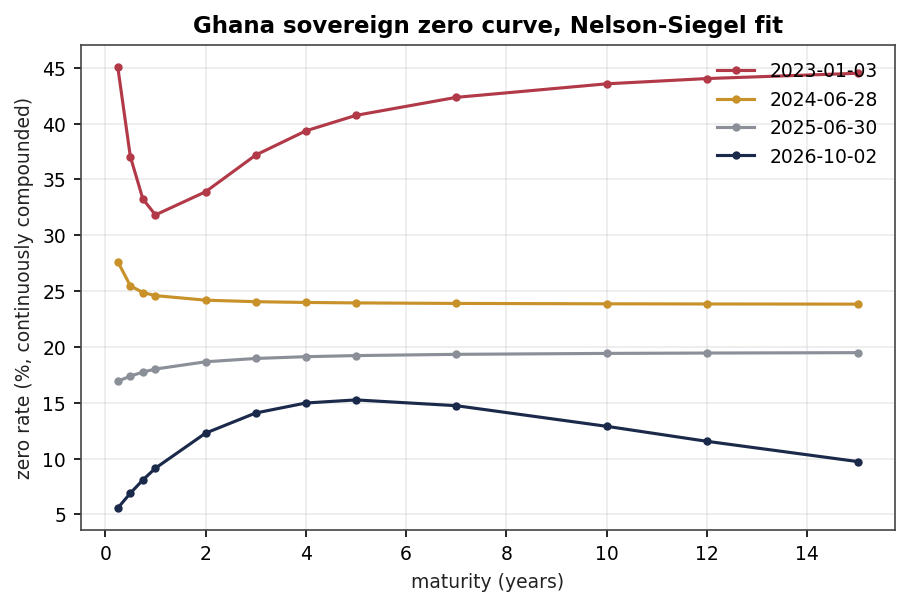

# Ghana Sovereign Yield Curve, 2023-2026

Daily zero-coupon curves for Ghana cedi government debt, built from 875 GFIM trading
reports covering the period from the Domestic Debt Exchange to October 2026.

Ghana defaulted on its domestic debt in December 2022. The exchange that followed in
February 2023 swapped most existing cedi bonds for new ones, inflation peaked above 50
percent, and the policy rate hit 30 percent. There is no official published zero curve
for the cedi market, so anyone who wants one has to build it from the daily security
quotes the Ghana Fixed Income Market publishes and the weekly auction results from the
Bank of Ghana. That is what this repository does, every trading day across the whole
recovery.



Read the full write-up here on GitHub: **[REPORT.md](REPORT.md)**. Every figure, table and
chunk of code renders in the browser with nothing to download. The same report as a styled
web page lives in `docs/index.html`, which GitHub Pages serves if you switch it on under
Settings, Pages, branch main, folder /docs. GitHub will not preview that file in the repo
view because it is 4 MB with the charts embedded, so use the markdown version or Pages.

## What came out of it

The curve starts high and badly behaved and ends looking like an ordinary upward sloping
curve. Three-month rates fall from roughly 40 percent to under 6. The slope from one year
to ten averaged minus 8.4 points in 2023, meaning short borrowing cost more than long, and
plus 3.3 points by 2026.

Two conventions had to be pinned down before anything else, and both can be tested against
data the market publishes twice over. Bills are quoted as a simple money-market yield on a
364-day year. That reproduces every published bill yield exactly, median error 0.0000 across
9,554 quotes, while actual/365 misses by 0.019 and actual/360 by 0.073. Bonds pay
semi-annual coupons, accrue on actual/365, and the published price is clean. Pricing them
that way lands within 0.03 per 100 face of the quoted price on securities that actually
traded.

Fit error is a result in its own right. The same model that leaves 416 basis points of
dispersion in 2023 leaves 73 in 2026. Quotes that disagreed wildly with each other now sit
on a smooth line, which is what returning liquidity looks like in the data.

Principal components on weekly curve changes give 87 percent to level, 7 to slope and 4 to
curvature. The level share is well above the 60 to 70 percent usually found in developed
markets, and it has a practical consequence. An equally weighted portfolio of traded bonds
carries DV01 of about 285 cedis per million of face. A one point parallel move costs 28,500
cedis. The same sized change in the shape of the curve costs 1,363. Hedge the level first.

Real returns flipped. In January 2023 a one-year lender to the government earned 17.8 points
below inflation. By August 2026 the same lender was 5.4 points ahead of it.

## Data

None of the raw market data is committed here. GSE and GFIM publish the trading reports
under their own terms, the files run to about 450 MB, and the Bank of Ghana and Ghana
Statistical Service series are all public downloads. Fetch them yourself:

| What | Where |
|---|---|
| GFIM daily trading reports (xlsx, one per day) | gfim.com.gh/daily-trading-reports |
| Security static data (ISIN, coupon, maturity) | gfim.com.gh/new-gog-notes-and-bonds and the old GoG and corporate lists |
| Treasury bill auction results | bog.gov.gh/treasury-and-the-markets/treasury-bill-rates |
| Weekly auction detail | bog.gov.gh/gog_auction_results |
| MPC policy rate history | bog.gov.gh |
| Monthly CPI | statsghana.gov.gh |

`src/gfim_download.py` handles the trading reports. It asks which years you want, finds the
files through the WordPress media API and the page itself, falls back to guessing file names
for anything missing, and saves into one folder per year. Run it with `--no-guess` first.
The two discovery routes find almost everything, and the guessing stage is slow.

Reference spreadsheets go in `data/raw/reference/`, trading reports in
`data/raw/GFIM_Reports/<year>/`. That is all the setup there is.

## Pipeline

```bash
pip install -r requirements.txt

python src/gfim_download.py 2023-2026 --no-guess   # fetch daily reports
python src/parse_reports.py                        # 875 files -> one tidy table
python src/build_dataset.py                        # join auctions, policy rate, inflation
python src/fit_curves.py                           # fit a curve per trading day
python src/analyse_curves.py                       # PCA, rich/cheap, risk, charts
```

Parsing takes about twelve minutes on a laptop. Fitting is quicker, two or three minutes for all 875 days, because the hard part is reading 875 spreadsheets rather than solving for four parameters.
Everything in between lands in `data/processed/`, and the outputs you would actually share
end up in `results/` and `figures/`.

The written report is an R Markdown document that reads the consolidated workbook and redoes
the analysis independently in R, which is a useful check on the Python side. Both agree:
portfolio DV01 of 284.90 in R against 284.88 in Python, PCA shares within a few tenths of a
point.

```r
install.packages(c("rmarkdown", "bookdown", "readxl", "dplyr", "tidyr", "ggplot2",
                   "lubridate", "purrr", "stringr", "scales", "knitr", "kableExtra",
                   "patchwork"))
# web page version, for GitHub Pages
rmarkdown::render("analysis/ghana_yield_curve_report.Rmd",
                  output_dir = "docs", output_file = "index.html")

# markdown version, readable in the repo itself
rmarkdown::render("analysis/ghana_yield_curve_report.Rmd",
                  output_format = bookdown::github_document2(number_sections = TRUE,
                                                             toc = TRUE),
                  output_dir = ".", output_file = "REPORT.md")
```

Set `fit_frequency: "daily"` in the YAML header for all 875 curves instead of the weekly
default. The weekly version knits in about two minutes.

## Layout

```
REPORT.md   the write-up, readable directly on GitHub
analysis/   R Markdown source for the report
report_files/  figures the markdown report points at
src/        Python pipeline, from download to analysis
docs/       same report as a styled web page, for GitHub Pages
figures/    charts produced by analyse_curves.py
results/    fitted curves, rich/cheap screen and scenario output as CSV
data/       empty by design, see data/README.md
```

Two modules carry the finance rather than the plumbing. `src/pricing.py` has the bill and
bond pricers, accrued interest, yield solvers, duration and DV01. `src/curves.py` has
Nelson-Siegel, Svensson and the bootstrap, plus the fit diagnostics.

## Choices worth knowing about

Pre-DDEP bonds are left out of the fitting universe. They barely trade and their quotes are
carried over from earlier sessions, so on 2 October 2026 they showed a median yield of 20.2
percent against 14.5 for the post-exchange bonds at similar maturities. Including them drags
the long end up by several points without adding information. Reinstating them is a one-line
change to `UNIVERSE` in `src/fit_curves.py` if you want it as a robustness check.

Quotes that did not trade on the day still enter the fit, weighted at 35 percent. Dropping
them entirely leaves too few points on most days. Weighting is the compromise.

Beyond about 11 years nothing trades, so the curve there is model output rather than market
pricing. Nelson-Siegel, Svensson and the bootstrap disagree by up to seven points at twenty
years on the same day's data. Figure 3.2 in the report shows exactly that, which is why
results are quoted to ten years.

Reported days to maturity in the source files are computed with an Excel `TODAY()` formula,
so they drift every time someone opens the workbook. Everything here recomputes maturity
minus report date.

## Limitations

Roughly six in ten quote rows are marks rather than trades. The 2023 curves sit on quotes
that no smooth curve fits well, so levels from that year deserve a margin. Real rates here
are ex post against published inflation, not against expected inflation, which is what a
lender actually prices. And the curve mixes expectations, term premium, credit and liquidity
with no way to separate them, since Ghana has no index-linked bond to anchor the split.

## Licence

Code is MIT, see LICENSE. The underlying market data belongs to GSE/GFIM, the Bank of Ghana
and the Ghana Statistical Service, and their terms govern any redistribution.

Derrick Delali Atiase. Questions and corrections welcome through issues.
