Constructing and Analysing the Ghana Sovereign Yield Curve, 2023–2026
================
Derrick Delali Atiase
05 October 2026

- [1 Why this project exists](#motivation)
  - [1.1 Objectives](#11-objectives)
  - [1.2 What this report finds, in brief](#preview)
- [2 Data](#2-data)
  - [2.1 Sources](#21-sources)
  - [2.2 What the market looks like](#22-what-the-market-looks-like)
- [3 Method](#3-method)
  - [3.1 Treasury bills: which day-count basis?](#bill-convention)
  - [3.2 Government bonds: frequency, day count, clean or
    dirty?](#bond-convention)
  - [3.3 Fitting the curve](#fitting)
  - [3.4 A single day, in detail](#single-day)
  - [3.5 Why pre-DDEP bonds are excluded](#universe)
- [4 Results](#4-results)
  - [4.1 Fitting every trading day](#41-fitting-every-trading-day)
  - [4.2 Finding 1: rates collapsed and the curve regained a normal
    slope](#finding-shape)
  - [4.3 Finding 2: the market itself became more
    orderly](#finding-quality)
  - [4.4 Finding 3: level, slope and curvature](#finding-factors)
  - [4.5 Finding 4: the curve, the policy rate and
    inflation](#finding-macro)
  - [4.6 Finding 5: what the curve expects next](#finding-forwards)
- [5 Applications](#5-applications)
  - [5.1 Which securities look rich or cheap?](#rich-cheap)
  - [5.2 What a rate move costs a portfolio](#risk)
- [6 What this means, in plain terms](#implications)
- [7 Limitations](#7-limitations)
- [8 Conclusion](#8-conclusion)
- [9 Appendix: reproducibility](#appendix)

# 1 Why this project exists

In December 2022 Ghana defaulted on its domestic debt. The Domestic Debt
Exchange Programme (DDEP) that followed in February 2023 swapped most
existing cedi government bonds for a new set of longer, lower-coupon
bonds. Inflation peaked above 50%, the policy rate reached 30%, and the
price of government borrowing stopped behaving like a normal market.

A **yield curve** is simply the answer to one question asked at many
horizons: *what interest rate does the government have to pay to borrow
for three months, one year, five years, ten years?* Plotting those rates
against their maturities gives a single picture of the cost of money in
an economy. It matters because:

- The **government** uses it to decide how much debt to issue and at
  what tenor.
- **Banks and pension funds** use it to value portfolios and measure
  interest rate risk; in Ghana, government securities are the largest
  asset class they hold.
- **Companies** price loans and corporate bonds off it.
- For **ordinary savers**, it is the benchmark behind Treasury bill
  returns and deposit rates.

Ghana has no published official zero-coupon curve. What exists is a
daily file of individual security quotes from the Ghana Fixed Income
Market (GFIM) and weekly Treasury bill auction results from the Bank of
Ghana. Turning those into a consistent curve, day by day, through a
sovereign default and its recovery, is the problem this project solves.

## 1.1 Objectives

1.  **Assemble** a clean daily dataset of every traded and quoted cedi
    government security from January 2023 to October 2026, joined to the
    policy rate, Treasury bill auction results and inflation.
2.  **Establish the market conventions empirically** — the day-count
    basis for bills, the coupon frequency and day count for bonds, and
    whether published prices are clean or dirty — rather than assuming
    them.
3.  **Fit a zero-coupon curve** for every trading day using
    bootstrapping, Nelson-Siegel and Svensson, and report how well each
    fits.
4.  **Describe how the curve evolved** through the post-default
    recovery, and relate its level, slope and curvature to the policy
    rate and inflation.
5.  **Apply the curve**: identify securities trading rich or cheap
    against it, and measure what a portfolio of government bonds loses
    or gains when rates move.

## 1.2 What this report finds, in brief

The curve starts in 2023 high and distorted, with short-dated borrowing
priced as dearly as long-dated borrowing, and ends in 2026 lower and
upward sloping. Short rates fall from roughly forty percent to the mid
single digits. Real returns to savers flip from deeply negative to
clearly positive. A single “level” factor drives almost all day-to-day
movement, which means a bond portfolio’s main risk is a general rise in
rates rather than a change in the curve’s shape. And the quality of the
market itself improves sharply: quotes that scattered widely in 2023
line up tightly on a smooth curve by 2026. Each of these is quantified
below.

# 2 Data

## 2.1 Sources

``` r
tibble(
  Source = c("GFIM daily trading reports", "GFIM / CSD security static data",
             "Bank of Ghana Treasury bill rates", "Bank of Ghana MPC decisions",
             "Ghana Statistical Service CPI"),
  Content = c("Daily price, yield, volume per security, 875 files",
              "ISIN, coupon, maturity, tenor",
              "Weekly primary auction discount and interest rates",
              "Policy rate decisions and effective dates",
              "Monthly headline year-on-year inflation"),
  Period = c("Jan 2023 – Oct 2026", "Current universe", "Aug 2013 – Sep 2026",
             "2002 – Sep 2026", "Jan 2023 – Aug 2026")
) |> tbl("Data sources used in the project.")
```

| Source                            | Content                                            | Period                       |
|:----------------------------------|:---------------------------------------------------|:-----------------------------|
| GFIM daily trading reports        | Daily price, yield, volume per security, 875 files | Jan 2023 \<U+2013\> Oct 2026 |
| GFIM / CSD security static data   | ISIN, coupon, maturity, tenor                      | Current universe             |
| Bank of Ghana Treasury bill rates | Weekly primary auction discount and interest rates | Aug 2013 \<U+2013\> Sep 2026 |
| Bank of Ghana MPC decisions       | Policy rate decisions and effective dates          | 2002 \<U+2013\> Sep 2026     |
| Ghana Statistical Service CPI     | Monthly headline year-on-year inflation            | Jan 2023 \<U+2013\> Aug 2026 |

<span id="tab:sources"></span>Table 2.1: Data sources used in the
project.

``` r
path <- params$data_path

quotes <- read_excel(path, sheet = "Curve_Inputs", guess_max = 20000) |>
  rename_with(~ tolower(gsub("[^a-z0-9]+", "_", tolower(.x)))) |>
  mutate(report_date = as.Date(report_date),
         maturity_date = as.Date(maturity_date),
         traded = as.logical(traded),
         use_for_fitting = as.logical(use_for_fitting))

panel <- read_excel(path, sheet = "Monthly_Panel") |>
  rename_with(~ tolower(gsub("[^a-z0-9]+", "_", tolower(.x)))) |>
  mutate(date = ceiling_date(as.Date(paste0(month, "-01")), "month") - 1)

cat(sprintf("%s quote rows | %s securities | %s trading days | %s to %s\n",
            format(nrow(quotes), big.mark = ","), n_distinct(quotes$isin),
            n_distinct(quotes$report_date), min(quotes$report_date),
            max(quotes$report_date)))
```

    ## 130,719 quote rows | 795 securities | 875 trading days | 2023-01-03 to 2026-10-02

## 2.2 What the market looks like

``` r
quotes |>
  group_by(Segment = segment) |>
  summarise(`Quote rows` = n(), Securities = n_distinct(isin),
            `Traded rows` = sum(traded),
            `Traded share` = percent(mean(traded), accuracy = 0.1),
            `Median yield (%)` = round(median(yield_pct, na.rm = TRUE), 2),
            .groups = "drop") |>
  arrange(desc(`Quote rows`)) |>
  tbl("Coverage and liquidity by market segment, January 2023 to October 2026. Segments are Treasury bills, post-DDEP bonds (ddep, gog_new), the pre-2023 combined sheet (gog) and pre-DDEP bonds (gog_old).")
```

| Segment | Quote rows | Securities | Traded rows | Traded share | Median yield (%) |
|:--------|------------|-----------:|-------------|--------------|------------------|
| bills   | 77,146     |        699 | 47,196      | 61.2%        | 22.05            |
| gog_old | 29,940     |         59 | 881         | 2.9%         | 21.75            |
| gog_new | 19,442     |         33 | 3,274       | 16.8%        | 16.67            |
| ddep    | 3,625      |         29 | 774         | 21.4%        | 13.30            |
| gog     | 566        |         63 | 282         | 49.8%        | 37.62            |

<span id="tab:coverage"></span>Table 2.2: Coverage and liquidity by
market segment, January 2023 to October 2026. Segments are Treasury
bills, post-DDEP bonds (ddep, gog_new), the pre-2023 combined sheet
(gog) and pre-DDEP bonds (gog_old).

Table <a href="#tab:coverage">2.2</a> carries two warnings for
everything that follows. First, **a quote is not a trade**: only about
four rows in ten represent an actual transaction, the rest being closing
marks carried over from an earlier session. Second, the **pre-DDEP bonds
(`gog_old`) show a far higher median yield** than post-DDEP bonds of
similar maturity, on almost no trading. Section
<a href="#universe">3.5</a> shows those are stale marks rather than
genuine bargains.

``` r
quotes |>
  mutate(Year = as.character(year(report_date))) |>
  group_by(Year, Instrument = instrument) |>
  summarise(Quotes = n(), Traded = sum(traded),
            `Traded share` = percent(mean(traded), accuracy = 0.1),
            `Volume (GHS bn)` = round(sum(volume, na.rm = TRUE) / 1e9, 1),
            .groups = "drop") |>
  tbl("Quotes, trades and turnover by year and instrument type.")
```

| Year | Instrument | Quotes | Traded | Traded share | Volume (GHS bn) |
|:-----|:-----------|-------:|-------:|:-------------|----------------:|
| 2023 | BILL       | 14,968 |  9,601 | 64.1%        |            47.1 |
| 2023 | BOND       | 14,129 |    868 | 6.1%         |            13.2 |
| 2024 | BILL       | 21,792 | 14,358 | 65.9%        |           117.6 |
| 2024 | BOND       | 16,877 |  1,138 | 6.7%         |            29.7 |
| 2025 | BILL       | 23,485 | 13,109 | 55.8%        |           126.8 |
| 2025 | BOND       | 13,374 |  1,817 | 13.6%        |            77.1 |
| 2026 | BILL       | 16,901 | 10,128 | 59.9%        |           140.0 |
| 2026 | BOND       |  9,193 |  1,388 | 15.1%        |           118.1 |

<span id="tab:liquidity-year"></span>Table 2.3: Quotes, trades and
turnover by year and instrument type.

Bills dominate turnover in every year, which is a feature of the market
rather than a quirk of the data: after the default, investors stayed
short.

# 3 Method

The curve cannot be fitted until we know how each instrument is quoted.
Rather than assume conventions, we test them against data the market
publishes twice over: both a price and a yield.

## 3.1 Treasury bills: which day-count basis?

``` r
BILL_BASIS <- 364

bill_price <- function(yield_pct, days, basis = BILL_BASIS)
  100 / (1 + yield_pct / 100 * days / basis)

bill_yield <- function(price, days, basis = BILL_BASIS)
  (100 / price - 1) * basis / days * 100
```

``` r
bt <- quotes |>
  filter(instrument == "BILL", !is.na(closing_price), !is.na(closing_yield),
         ttm_days > 0, closing_price > 0)

tibble(`Day-count basis` = c("Actual/360", "Actual/364", "Actual/365")) |>
  mutate(`Median absolute error (pp)` = map_dbl(c(360, 364, 365), ~ median(abs(
    bill_yield(bt$closing_price, bt$ttm_days, .x) - bt$closing_yield)))) |>
  tbl(paste0("Testing the bill convention: median gap between the yield implied by the published price and the published yield itself, across ",
             format(nrow(bt), big.mark = ","), " quotes."), digits = 4)
```

| Day-count basis | Median absolute error (pp) |
|:----------------|---------------------------:|
| Actual/360      |                     0.0732 |
| Actual/364      |                     0.0000 |
| Actual/365      |                     0.0186 |

<span id="tab:bill-convention"></span>Table 3.1: Testing the bill
convention: median gap between the yield implied by the published price
and the published yield itself, across 9,554 quotes.

Actual/364 reproduces GFIM’s published bill yields **exactly**. The
other two bases do not. In plain terms, a Ghanaian Treasury bill is
quoted as a simple money-market yield on a 364-day year, and that single
fact lets us recover yields for the 2023 and 2024 reports, which
published prices only.

## 3.2 Government bonds: frequency, day count, clean or dirty?

``` r
add_months_safe <- function(d, n) d %m+% months(n)

coupon_dates <- function(settle, maturity, freq = 2) {
  step <- 12 / freq; out <- c(); d <- maturity
  while (d > settle) { out <- c(out, d); d <- add_months_safe(d, -step) }
  sort(as.Date(out, origin = "1970-01-01"))
}

yearfrac <- function(from, to, convention = "act/365") {
  switch(convention,
         "act/365" = as.numeric(to - from) / 365,
         "30/360"  = { d1 <- pmin(day(from), 30); d2 <- pmin(day(to), 30)
           ((year(to) - year(from)) * 360 + (month(to) - month(from)) * 30 +
              (d2 - d1)) / 360 },
         stop("unknown convention"))
}

accrued_interest <- function(settle, maturity, coupon, freq = 2,
                             convention = "act/365") {
  if (is.na(coupon) || coupon == 0) return(0)
  nxt <- coupon_dates(settle, maturity, freq)[1]
  prev <- add_months_safe(nxt, -12 / freq)
  period <- yearfrac(prev, nxt, convention)
  if (period <= 0) return(0)
  coupon / freq * yearfrac(prev, settle, convention) / period
}

bond_clean_price <- function(ytm, settle, maturity, coupon, freq = 2,
                             convention = "act/365") {
  d <- coupon_dates(settle, maturity, freq)
  if (!length(d)) return(NA_real_)
  t <- yearfrac(settle, d, convention) * freq
  cf <- rep(coupon / freq, length(d)); cf[length(cf)] <- cf[length(cf)] + 100
  sum(cf / (1 + ytm / 100 / freq)^t) -
    accrued_interest(settle, maturity, coupon, freq, convention)
}

bond_ytm <- function(clean, settle, maturity, coupon, freq = 2,
                     convention = "act/365") {
  f <- function(y) bond_clean_price(y, settle, maturity, coupon, freq,
                                    convention) - clean
  tryCatch(uniroot(f, c(-20, 300), tol = 1e-8)$root, error = function(e) NA_real_)
}
```

``` r
set.seed(1)
bs <- quotes |>
  filter(instrument == "BOND", use_for_fitting, !is.na(coupon_pct),
         ttm_years > 0.6, between(closing_price, 20, 160),
         between(yield_pct, 1, 80)) |>
  slice_sample(n = 800)

grid <- expand_grid(Frequency = c("Annual", "Semi-annual"),
                    `Day count` = c("act/365", "30/360")) |>
  mutate(freq = ifelse(Frequency == "Annual", 1, 2))

grid$`Median absolute price error` <- pmap_dbl(
  list(grid$freq, grid$`Day count`), function(f, conv) {
    p <- pmap_dbl(list(bs$yield_pct, bs$report_date, bs$maturity_date, bs$coupon_pct),
                  ~ bond_clean_price(..1, ..2, ..3, ..4, f, conv))
    median(abs(p - bs$closing_price), na.rm = TRUE)
  })

grid |> select(-freq) |>
  tbl("Testing the bond convention on 800 randomly sampled quotes: median gap between the price implied by the published yield and the published price, per 100 face value.", digits = 4)
```

| Frequency   | Day count | Median absolute price error |
|:------------|:----------|----------------------------:|
| Annual      | act/365   |                      0.4565 |
| Annual      | 30/360    |                      0.4633 |
| Semi-annual | act/365   |                      0.1094 |
| Semi-annual | 30/360    |                      0.1140 |

<span id="tab:bond-convention"></span>Table 3.2: Testing the bond
convention on 800 randomly sampled quotes: median gap between the price
implied by the published yield and the published price, per 100 face
value.

``` r
model_clean <- pmap_dbl(list(bs$yield_pct, bs$report_date, bs$maturity_date, bs$coupon_pct),
                        ~ bond_clean_price(..1, ..2, ..3, ..4))
ai <- pmap_dbl(list(bs$report_date, bs$maturity_date, bs$coupon_pct),
               ~ accrued_interest(..1, ..2, ..3))
clean_err <- model_clean - bs$closing_price

tibble(Assumption = c("Published price is clean (all quotes)",
                      "Published price is clean (traded quotes only)",
                      "Published price is dirty (all quotes)"),
       `Median absolute error` = c(median(abs(clean_err), na.rm = TRUE),
                                   median(abs(clean_err[bs$traded]), na.rm = TRUE),
                                   median(abs(model_clean + ai - bs$closing_price), na.rm = TRUE))) |>
  tbl("Is the published bond price clean or dirty? Median absolute pricing error per 100 face under each assumption.", digits = 4)
```

| Assumption                                    | Median absolute error |
|:----------------------------------------------|----------------------:|
| Published price is clean (all quotes)         |                0.1094 |
| Published price is clean (traded quotes only) |                0.0301 |
| Published price is dirty (all quotes)         |                3.9933 |

<span id="tab:clean-dirty"></span>Table 3.3: Is the published bond price
clean or dirty? Median absolute pricing error per 100 face under each
assumption.

Tables <a href="#tab:bond-convention">3.2</a> and
<a href="#tab:clean-dirty">3.3</a> settle the bond convention:
**semi-annual coupons, actual/365, quoted clean**. The pricing error is
about 0.11 per 100 face across all quotes but only 0.03 on quotes that
actually traded. That difference is informative in itself: the residual
error on untraded lines is staleness, not a flaw in the pricing model,
and it justifies weighting traded quotes more heavily when fitting.

## 3.3 Fitting the curve

Each day’s securities are turned into cash flows: a bill is one payment
at maturity, a bond is a stream of semi-annual coupons plus principal. A
candidate curve discounts those cash flows; the fitted curve is the one
whose prices come closest to market prices, with three safeguards:

- quotes more than three robust deviations from the local median yield
  are dropped, so one bad print cannot bend the curve;
- each quote is weighted by the inverse of its maturity, so a price
  error at ten years is not allowed to swamp an equal-sized error at
  three months;
- quotes that did not trade that day are weighted at 35%.

``` r
UNIVERSE <- c("bills", "ddep", "gog_new", "gog")
UNTRADED_W <- 0.35
GRID <- c(0.25, 0.5, 0.75, 1, 2, 3, 4, 5, 7, 10, 12, 15)

build_day <- function(rows, settle) {
  rows <- rows |> filter(segment %in% UNIVERSE, use_for_fitting,
                         !is.na(closing_price), closing_price > 0,
                         ttm_years > 0) |> arrange(ttm_years)
  if (nrow(rows) < 10) return(NULL)
  k <- min(9, 2 * floor(nrow(rows) / 2) - 1)
  resid <- abs(rows$yield_pct - stats::runmed(rows$yield_pct, k = k))
  mad <- median(resid, na.rm = TRUE)
  rows <- rows[resid <= 3 * 1.4826 * mad + 0.75, ]
  if (nrow(rows) < 8) return(NULL)

  flows <- map_dfr(seq_len(nrow(rows)), function(i) {
    r <- rows[i, ]
    if (r$instrument == "BILL") return(tibble(id = i, t = r$ttm_years, cf = 100))
    d <- coupon_dates(settle, r$maturity_date)
    if (!length(d)) return(NULL)
    cf <- rep(r$coupon_pct / 2, length(d)); cf[length(cf)] <- cf[length(cf)] + 100
    tibble(id = i, t = yearfrac(settle, d), cf = cf)
  })
  price <- map_dbl(seq_len(nrow(rows)), function(i) {
    r <- rows[i, ]
    if (r$instrument == "BILL") r$closing_price
    else r$closing_price + accrued_interest(settle, r$maturity_date, r$coupon_pct)
  })
  list(rows = rows, flows = flows, price = price,
       weight = (1 / pmax(rows$ttm_years, 0.1)) *
         ifelse(rows$traded, 1, UNTRADED_W))
}

ns_zero <- function(t, b0, b1, b2, tau) {
  x <- pmax(t, 1e-6) / tau; decay <- (1 - exp(-x)) / x
  b0 + b1 * decay + b2 * (decay - exp(-x))
}
sv_zero <- function(t, b0, b1, b2, b3, tau1, tau2) {
  x1 <- pmax(t, 1e-6) / tau1; x2 <- pmax(t, 1e-6) / tau2
  d1 <- (1 - exp(-x1)) / x1; d2 <- (1 - exp(-x2)) / x2
  b0 + b1 * d1 + b2 * (d1 - exp(-x1)) + b3 * (d2 - exp(-x2))
}
model_prices <- function(day, zfn) {
  z <- zfn(day$flows$t) / 100
  as.numeric(tapply(day$flows$cf * exp(-z * day$flows$t), day$flows$id, sum))
}
huber <- function(r, k = 0.3) ifelse(abs(r) <= k, 0.5 * r^2, k * (abs(r) - 0.5 * k))

fit_ns <- function(day) {
  y <- day$rows$yield_pct
  short <- median(y[day$rows$ttm_years < 1], na.rm = TRUE)
  long  <- median(y[day$rows$ttm_years > 5], na.rm = TRUE)
  if (is.na(short)) short <- median(y, na.rm = TRUE)
  if (is.na(long))  long  <- short
  obj <- function(p) sum(huber((model_prices(
    day, function(t) ns_zero(t, p[1], p[2], p[3], p[4])) - day$price) * day$weight))
  optim(c(long, short - long, 0, 1.5), obj, method = "L-BFGS-B",
        lower = c(-50, -100, -100, 0.05), upper = c(200, 100, 100, 30),
        control = list(maxit = 500))$par
}

fit_sv <- function(day, start) {
  obj <- function(p) sum(huber((model_prices(
    day, function(t) sv_zero(t, p[1], p[2], p[3], p[4], p[5], p[6])) - day$price) * day$weight))
  optim(c(start[1:3], 0, start[4], max(start[4] * 3, 5)), obj, method = "L-BFGS-B",
        lower = c(-50, -100, -100, -100, 0.05, 0.05),
        upper = c(200, 100, 100, 100, 30, 30), control = list(maxit = 800))$par
}

bootstrap_curve <- function(day) {
  bills <- which(day$rows$instrument == "BILL")
  kt <- day$rows$ttm_years[bills]
  kz <- -log(day$price[bills] / 100) / kt * 100
  ord <- order(kt); kt <- kt[ord]; kz <- kz[ord]
  bonds <- which(day$rows$instrument == "BOND")
  bonds <- bonds[order(day$rows$ttm_years[bonds])]
  for (i in bonds) {
    tmax <- day$rows$ttm_years[i]
    if (tmax <= max(kt)) next
    f <- function(zl) {
      kt2 <- c(kt, tmax); kz2 <- c(kz, zl)
      fl <- day$flows[day$flows$id == i, ]
      z <- approx(kt2, kz2, fl$t, rule = 2)$y / 100
      sum(fl$cf * exp(-z * fl$t)) - day$price[i]
    }
    zl <- tryCatch(uniroot(f, c(-20, 200), tol = 1e-8)$root, error = function(e) NA)
    if (!is.na(zl)) { kt <- c(kt, tmax); kz <- c(kz, zl) }
  }
  list(t = kt, z = kz, fn = function(tt) approx(kt, kz, tt, rule = 2)$y)
}

fit_quality <- function(day, zfn) {
  e <- model_prices(day, zfn) - day$price
  c(rmse_price = sqrt(mean(e^2)),
    rmse_yield_bp = sqrt(mean((e * day$weight)^2)) * 100)
}
```

## 3.4 A single day, in detail

``` r
last_date <- max(quotes$report_date)
day <- build_day(filter(quotes, report_date == last_date), last_date)
p_ns <- fit_ns(day)
p_sv <- fit_sv(day, p_ns)
bs_curve <- bootstrap_curve(day)

tibble(Method = c("Nelson-Siegel", "Svensson", "Bootstrap"),
       `RMSE (bp)` = c(fit_quality(day, function(t) ns_zero(t, p_ns[1], p_ns[2], p_ns[3], p_ns[4]))[["rmse_yield_bp"]],
                       fit_quality(day, function(t) sv_zero(t, p_sv[1], p_sv[2], p_sv[3], p_sv[4], p_sv[5], p_sv[6]))[["rmse_yield_bp"]],
                       fit_quality(day, bs_curve$fn)[["rmse_yield_bp"]]),
       Parameters = c(4, 6, length(bs_curve$t)),
       `1-year (%)` = c(ns_zero(1, p_ns[1], p_ns[2], p_ns[3], p_ns[4]),
                        sv_zero(1, p_sv[1], p_sv[2], p_sv[3], p_sv[4], p_sv[5], p_sv[6]),
                        bs_curve$fn(1)),
       `5-year (%)` = c(ns_zero(5, p_ns[1], p_ns[2], p_ns[3], p_ns[4]),
                        sv_zero(5, p_sv[1], p_sv[2], p_sv[3], p_sv[4], p_sv[5], p_sv[6]),
                        bs_curve$fn(5)),
       `10-year (%)` = c(ns_zero(10, p_ns[1], p_ns[2], p_ns[3], p_ns[4]),
                         sv_zero(10, p_sv[1], p_sv[2], p_sv[3], p_sv[4], p_sv[5], p_sv[6]),
                         bs_curve$fn(10))) |>
  tbl(paste("Three fitting methods compared on", format(last_date, "%d %B %Y"),
            "- fit error, number of parameters and the fitted zero rate at three maturities."))
```

| Method        | RMSE (bp) | Parameters | 1-year (%) | 5-year (%) | 10-year (%) |
|:--------------|----------:|-----------:|-----------:|-----------:|------------:|
| Nelson-Siegel |     48.07 |          4 |       9.19 |      15.32 |       12.88 |
| Svensson      |     48.03 |          6 |       9.20 |      15.21 |       13.16 |
| Bootstrap     |      0.05 |         99 |       9.36 |      13.97 |       15.10 |

<span id="tab:single-day"></span>Table 3.4: Three fitting methods
compared on 02 October 2026 - fit error, number of parameters and the
fitted zero rate at three maturities.

``` r
library(patchwork)

tt <- seq(0.05, max(day$rows$ttm_years), length.out = 300)
curves_df <- bind_rows(
  tibble(t = tt, z = ns_zero(tt, p_ns[1], p_ns[2], p_ns[3], p_ns[4]), Method = "Nelson-Siegel"),
  tibble(t = tt, z = sv_zero(tt, p_sv[1], p_sv[2], p_sv[3], p_sv[4], p_sv[5], p_sv[6]), Method = "Svensson"),
  tibble(t = tt, z = bs_curve$fn(tt), Method = "Bootstrap"))

obs_df <- day$rows |> transmute(t = ttm_years, y = yield_pct,
                                Traded = ifelse(traded, "Traded", "Not traded"))

method_cols <- c(`Nelson-Siegel` = navy, Svensson = gold, Bootstrap = red)

p_curves <- ggplot() +
  geom_point(data = obs_df, aes(t, y, shape = Traded), colour = grey,
             size = 1.6, alpha = .7) +
  geom_line(data = curves_df, aes(t, z, colour = Method, linetype = Method),
            linewidth = .9) +
  scale_colour_manual(values = method_cols) +
  scale_linetype_manual(values = c(`Nelson-Siegel` = 1, Svensson = 2, Bootstrap = 3)) +
  labs(title = "Three fits to the same day's quotes",
       subtitle = format(last_date, "%d %B %Y"),
       x = NULL, y = "Zero rate / yield (%)", shape = NULL)

resid_df <- bind_rows(
  tibble(t = day$rows$ttm_years, Method = "Nelson-Siegel",
         bp = (model_prices(day, function(x) ns_zero(x, p_ns[1], p_ns[2], p_ns[3], p_ns[4])) -
                 day$price) * day$weight * 100),
  tibble(t = day$rows$ttm_years, Method = "Svensson",
         bp = (model_prices(day, function(x) sv_zero(x, p_sv[1], p_sv[2], p_sv[3], p_sv[4], p_sv[5], p_sv[6])) -
                 day$price) * day$weight * 100),
  tibble(t = day$rows$ttm_years, Method = "Bootstrap",
         bp = (model_prices(day, bs_curve$fn) - day$price) * day$weight * 100))

p_resid <- ggplot(resid_df, aes(t, bp, colour = Method)) +
  geom_hline(yintercept = 0, colour = "grey60") +
  geom_point(size = 1.5, alpha = .8) +
  facet_wrap(~ Method, nrow = 1) +
  scale_colour_manual(values = method_cols, guide = "none") +
  labs(title = "Pricing errors by maturity",
       x = "Years to maturity", y = "Error (basis points)", caption = SRC)

p_curves / p_resid + plot_layout(heights = c(1.15, 1))
```

<div class="figure" style="text-align: center">

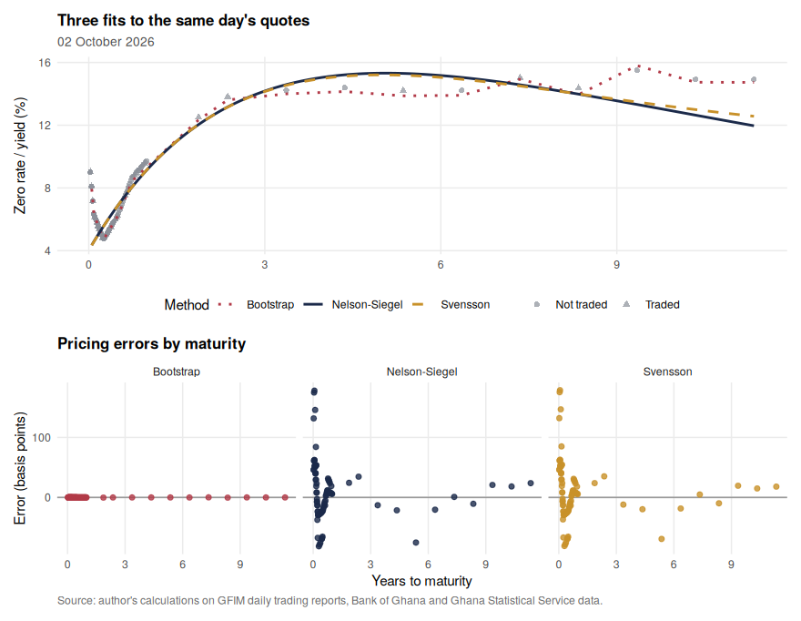

<p class="caption">

<span id="fig:fig-methods"></span>Figure 3.1: The three fitting methods
compared on the last trading day. Top panel: the fitted zero curves
against the observed quotes (shown as yields, which sit slightly above
continuously compounded zero rates at the same maturity). Bottom panel:
each method’s pricing error per security, converted to basis points of
yield. The bootstrap passes through the bill points by construction; the
two parametric curves trade exactness for smoothness.

</p>

</div>

Figure <a href="#fig:fig-methods">3.1</a> shows what Table
<a href="#tab:single-day">3.4</a> only summarises. All three methods
agree closely out to about five years, where the bills and shorter bonds
crowd together, and separate at the long end where the data thins out.
The residual panel explains the ranking: the bootstrap drives errors on
the bill points to zero because it is built to pass through them, but it
inherits every kink in the data and has as many parameters as
instruments. Svensson adds two parameters to Nelson-Siegel and buys very
little here. **Nelson-Siegel is used for the rest of the report**: four
interpretable parameters, a smooth curve, and fit error close to the
alternatives.

``` r
tt2 <- seq(0.05, 20, length.out = 300)
maxt <- max(day$rows$ttm_years)

bind_rows(
  tibble(t = tt2, z = ns_zero(tt2, p_ns[1], p_ns[2], p_ns[3], p_ns[4]), Method = "Nelson-Siegel"),
  tibble(t = tt2, z = sv_zero(tt2, p_sv[1], p_sv[2], p_sv[3], p_sv[4], p_sv[5], p_sv[6]), Method = "Svensson"),
  tibble(t = tt2, z = bs_curve$fn(tt2), Method = "Bootstrap")) |>
  ggplot(aes(t, z, colour = Method, linetype = Method)) +
  annotate("rect", xmin = maxt, xmax = 20, ymin = -Inf, ymax = Inf,
           fill = "grey85", alpha = .5) +
  geom_point(data = transmute(day$rows, t = ttm_years, z = yield_pct),
             aes(t, z), inherit.aes = FALSE, colour = grey, size = 1.4,
             alpha = .7) +
  annotate("text", x = (maxt + 20) / 2, y = Inf, vjust = 1.6,
           label = "no traded securities", size = 3, colour = "grey35") +
  geom_vline(xintercept = maxt, colour = "grey50", linetype = 3) +
  geom_line(linewidth = .9) +
  scale_colour_manual(values = method_cols) +
  scale_linetype_manual(values = c(`Nelson-Siegel` = 1, Svensson = 2, Bootstrap = 3)) +
  labs(title = "Where the methods disagree: the extrapolated long end",
       subtitle = paste("Longest traded security matures in", round(maxt, 1), "years"),
       x = "Years to maturity", y = "Zero rate (%)", caption = SRC)
```

<div class="figure" style="text-align: center">

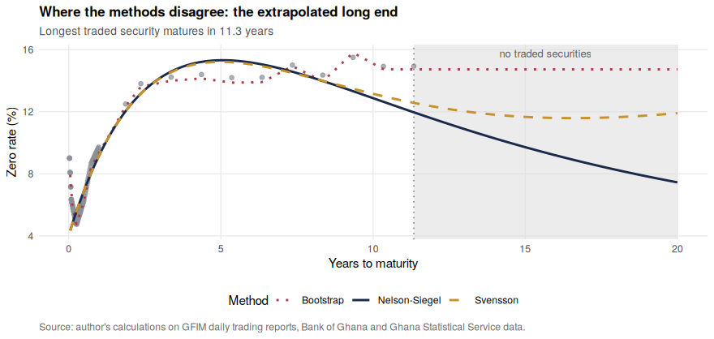

<p class="caption">

<span id="fig:fig-methods-long"></span>Figure 3.2: The same three fits
extended to twenty years, with the actual market quotes shown as grey
points. The shaded region marks maturities where no security trades, so
the curves there are extrapolation. Nelson-Siegel and Svensson decay
towards their long-run parameters while the bootstrap simply holds its
last observed level flat.

</p>

</div>

``` r
obs_rep <- map_dfr(names(method_cols), ~ mutate(obs_df, Method = .x)) |>
  mutate(Method = factor(Method, levels = names(method_cols)))

curves_df |> mutate(Method = factor(Method, levels = names(method_cols))) |>
  ggplot(aes(t, z)) +
  geom_point(data = obs_rep, aes(t, y), colour = grey, size = 1.2, alpha = .65) +
  geom_line(aes(colour = Method), linewidth = .9) +
  facet_wrap(~ Method, nrow = 1) +
  scale_colour_manual(values = method_cols, guide = "none") +
  labs(title = "Actual quotes and fitted curve, by method",
       subtitle = format(last_date, "%d %B %Y"),
       x = "Years to maturity", y = "Zero rate / yield (%)", caption = SRC)
```

<div class="figure" style="text-align: center">

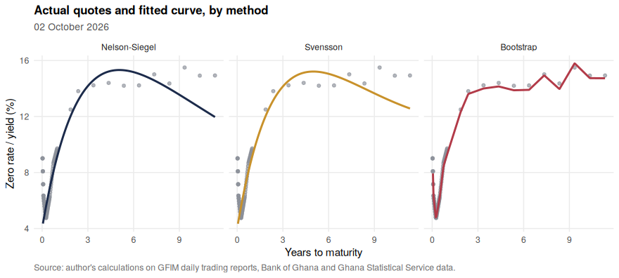

<p class="caption">

<span id="fig:fig-methods-facet"></span>Figure 3.3: Actual quotes
against each fitted curve, one panel per method. Grey points are the
market quotes that entered the fit; the coloured line is that method’s
curve. Plotting them separately makes it easier to see where each method
tracks the data and where it smooths through it.

</p>

</div>

``` r
fitted_prices <- bind_rows(
  tibble(Method = "Nelson-Siegel", actual = day$price,
         fitted = model_prices(day, function(x) ns_zero(x, p_ns[1], p_ns[2], p_ns[3], p_ns[4]))),
  tibble(Method = "Svensson", actual = day$price,
         fitted = model_prices(day, function(x) sv_zero(x, p_sv[1], p_sv[2], p_sv[3], p_sv[4], p_sv[5], p_sv[6]))),
  tibble(Method = "Bootstrap", actual = day$price,
         fitted = model_prices(day, bs_curve$fn))) |>
  mutate(Method = factor(Method, levels = names(method_cols)))

lab <- fitted_prices |> group_by(Method) |>
  summarise(rmse = sqrt(mean((fitted - actual)^2)), .groups = "drop") |>
  mutate(facet = sprintf("%s (RMSE %.2f)", Method, rmse))

fitted_prices |> left_join(lab, by = "Method") |>
  mutate(facet = factor(facet, levels = lab$facet)) |>
  ggplot(aes(actual, fitted, colour = Method)) +
  geom_abline(slope = 1, intercept = 0, linetype = 2, colour = "grey50") +
  geom_point(size = 1.5, alpha = .8) +
  facet_wrap(~ facet, nrow = 1) +
  scale_colour_manual(values = method_cols, guide = "none") +
  labs(title = "Actual against fitted prices",
       subtitle = paste("All securities in the fit,", format(last_date, "%d %B %Y")),
       x = "Market price (per 100 face)", y = "Fitted price (per 100 face)",
       caption = SRC)
```

<div class="figure" style="text-align: center">

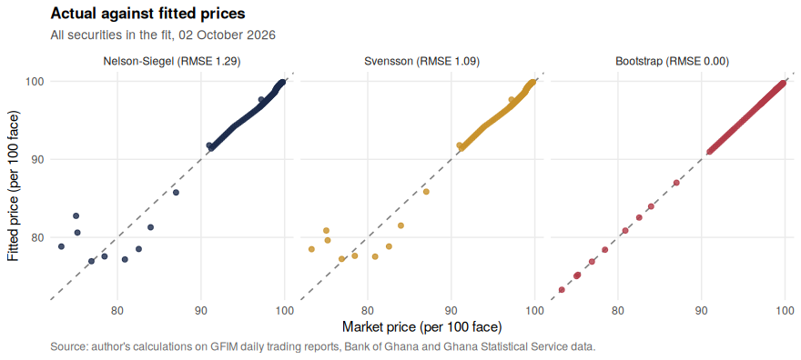

<p class="caption">

<span id="fig:fig-actual-fitted"></span>Figure 3.4: Actual against
fitted prices for every security in the fit. Each point is one security:
the horizontal axis is the price the market quoted, the vertical axis
the price the fitted curve implies. The dashed line is perfect
agreement, so distance from it is the pricing error. Panel headings give
the root mean squared error in cedis per 100 face.

</p>

</div>

Figures <a href="#fig:fig-methods-facet">3.3</a> and
<a href="#fig:fig-actual-fitted">3.4</a> show the same comparison two
ways: against maturity, and actual against fitted price. In the price
scatter the bootstrap sits almost exactly on the 45-degree line, as it
must, while the two parametric curves show a visible spread. That spread
is the price of smoothness, and it is small enough in cedi terms to be
worth paying.

The second panel is a caution for anyone quoting a fifteen-year Ghanaian
rate. Past about 11.3 years the three methods diverge because nothing
trades there, so the number depends on the model rather than the market.
Results in this report are quoted to ten years for that reason.

``` r
obs <- day$rows |> transmute(ttm_years, yield_pct,
                             Traded = ifelse(traded, "Traded", "Not traded"),
                             Instrument = instrument)
line <- tibble(t = seq(0.05, max(obs$ttm_years), length.out = 300)) |>
  mutate(z = ns_zero(t, p_ns[1], p_ns[2], p_ns[3], p_ns[4]))

ggplot() +
  geom_point(data = obs, aes(ttm_years, yield_pct, colour = Traded,
                             shape = Instrument), size = 2, alpha = .85) +
  geom_line(data = line, aes(t, z), colour = navy, linewidth = 1) +
  scale_colour_manual(values = c(Traded = navy, `Not traded` = grey)) +
  labs(title = paste("Fitted zero curve,", format(last_date, "%d %B %Y")),
       subtitle = "Nelson-Siegel curve against individual security quotes",
       x = "Years to maturity", y = "Yield / zero rate (%)", caption = SRC)
```

<div class="figure" style="text-align: center">

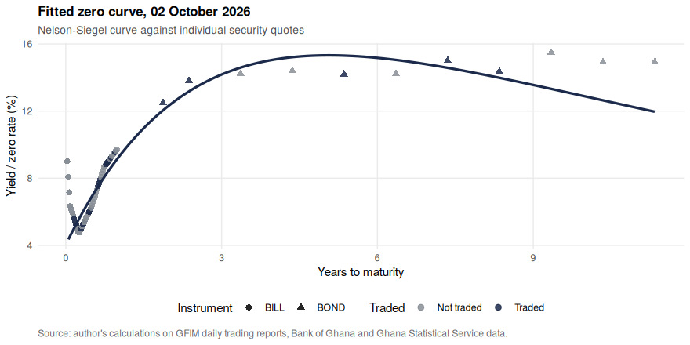

<p class="caption">

<span id="fig:fig-single-day"></span>Figure 3.5: Observed market quotes
and the fitted Nelson-Siegel curve on the last trading day of the
sample. Each point is one security: circles are Treasury bills,
triangles are bonds. Dark points traded that day; grey points are
carried-over marks. The curve tracks the traded cluster rather than the
stale quotes.

</p>

</div>

## 3.5 Why pre-DDEP bonds are excluded

``` r
quotes |>
  filter(report_date == last_date,
         segment %in% c("bills", "ddep", "gog_new", "gog_old")) |>
  group_by(Segment = segment) |>
  summarise(Securities = n(), Traded = sum(traded),
            `Median yield (%)` = round(median(yield_pct, na.rm = TRUE), 2),
            `Longest maturity (yrs)` = round(max(ttm_years), 1), .groups = "drop") |>
  tbl(paste("Why pre-DDEP bonds are left out: segment comparison on",
            format(last_date, "%d %B %Y"), "- old bonds show much higher yields on almost no trading."))
```

| Segment | Securities | Traded | Median yield (%) | Longest maturity (yrs) |
|:--------|-----------:|-------:|-----------------:|-----------------------:|
| bills   |         91 |     28 |             6.15 |                    1.0 |
| ddep    |         29 |      7 |            14.30 |                   11.3 |
| gog_new |          2 |      1 |            12.20 |                    6.5 |
| gog_old |         17 |      0 |            20.18 |                   12.8 |

<span id="tab:universe"></span>Table 3.5: Why pre-DDEP bonds are left
out: segment comparison on 02 October 2026 - old bonds show much higher
yields on almost no trading.

A bond that has not traded for months but is still quoted at a stale
price looks cheap when it is merely forgotten. Including the `gog_old`
bonds pulls the long end of the fitted curve up by several percentage
points without adding information. They are excluded; reinstating them
is a one-line change to `UNIVERSE` for a robustness check.

# 4 Results

## 4.1 Fitting every trading day

``` r
all_dates <- sort(unique(quotes$report_date))
fit_dates <- if (params$fit_frequency == "daily") all_dates else {
  tibble(d = all_dates) |> mutate(wk = floor_date(d, "week")) |>
    group_by(wk) |> slice_max(d, n = 1) |> pull(d)
}

by_date <- quotes |> filter(segment %in% UNIVERSE, use_for_fitting) |>
  group_split(report_date)
names(by_date) <- map_chr(by_date, ~ as.character(.x$report_date[1]))

fit_one <- function(key) {
  d <- as.Date(key); rows <- by_date[[key]]
  if (is.null(rows)) return(NULL)
  dd <- build_day(rows, d); if (is.null(dd)) return(NULL)
  p <- fit_ns(dd)
  q <- fit_quality(dd, function(t) ns_zero(t, p[1], p[2], p[3], p[4]))
  z <- as.list(ns_zero(GRID, p[1], p[2], p[3], p[4]))
  names(z) <- paste0("z", GRID, "y")
  bind_cols(tibble(report_date = d, n = nrow(dd$rows),
                   n_traded = sum(dd$rows$traded),
                   max_ttm = max(dd$rows$ttm_years),
                   beta0 = p[1], beta1 = p[2], beta2 = p[3], tau = p[4],
                   rmse_bp = q[["rmse_yield_bp"]]), as_tibble(z))
}

fits <- map_dfr(as.character(fit_dates), fit_one) |>
  mutate(level = beta0, slope = -beta1, curvature = beta2)

cat(sprintf("%d curves fitted (%s), %s to %s\n", nrow(fits),
            params$fit_frequency, min(fits$report_date), max(fits$report_date)))
```

    ## 189 curves fitted (weekly), 2023-01-06 to 2026-10-02

## 4.2 Finding 1: rates collapsed and the curve regained a normal slope

``` r
snaps <- c(min(fits$report_date),
           fits$report_date[which.min(abs(fits$report_date - as.Date("2024-06-30")))],
           fits$report_date[which.min(abs(fits$report_date - as.Date("2025-06-30")))],
           max(fits$report_date))

fits |> filter(report_date %in% snaps) |>
  select(report_date, starts_with("z")) |>
  pivot_longer(-report_date, names_to = "mat", values_to = "zero") |>
  mutate(maturity = as.numeric(str_remove_all(mat, "[zy]")),
         Date = factor(format(report_date, "%d %b %Y"),
                       levels = format(sort(snaps), "%d %b %Y"))) |>
  ggplot(aes(maturity, zero, colour = Date)) +
  geom_line(linewidth = 1) + geom_point(size = 1.8) +
  scale_colour_manual(values = c(red, gold, grey, navy)) +
  scale_y_continuous(labels = label_percent(scale = 1)) +
  labs(title = "Lower rates and a normal slope",
       subtitle = "Fitted zero-coupon curves, four dates",
       x = "Years to maturity", y = "Zero rate", colour = "Curve date",
       caption = SRC)
```

<div class="figure" style="text-align: center">

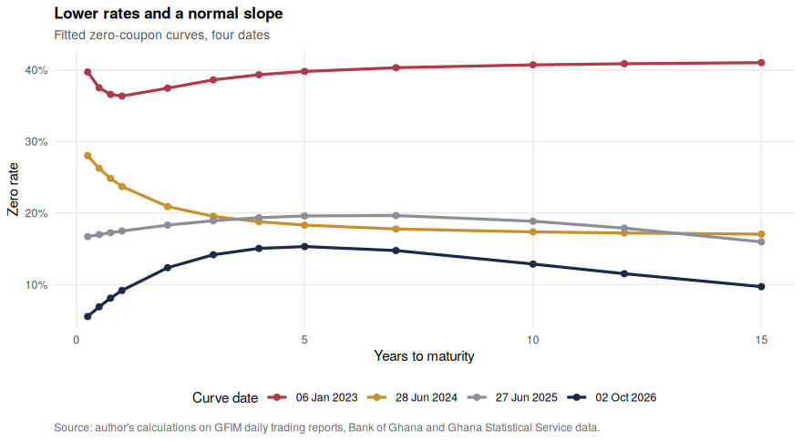

<p class="caption">

<span id="fig:fig-snapshots"></span>Figure 4.1: The Ghana sovereign zero
curve on one date from each year of the sample. The vertical shift
between the lines is the fall in the general level of rates; the change
in tilt is the return of a normal upward slope. Exact values are in
Table 4.2.

</p>

</div>

``` r
fits |> filter(report_date %in% snaps) |>
  transmute(Date = format(report_date, "%d %b %Y"),
            `3m` = z0.25y, `1y` = z1y, `2y` = z2y, `5y` = z5y,
            `10y` = z10y, `Slope 10y-1y (pp)` = z10y - z1y) |>
  tbl("Fitted zero rates (%) at selected maturities on the four snapshot dates.")
```

| Date        |    3m |    1y |    2y |    5y |   10y | Slope 10y-1y (pp) |
|:------------|------:|------:|------:|------:|------:|------------------:|
| 06 Jan 2023 | 39.70 | 36.34 | 37.44 | 39.78 | 40.70 |              4.36 |
| 28 Jun 2024 | 28.03 | 23.71 | 20.91 | 18.32 | 17.37 |             -6.34 |
| 27 Jun 2025 | 16.72 | 17.49 | 18.32 | 19.60 | 18.86 |              1.37 |
| 02 Oct 2026 |  5.55 |  9.19 | 12.37 | 15.32 | 12.88 |              3.69 |

<span id="tab:tab-snapshots"></span>Table 4.1: Fitted zero rates (%) at
selected maturities on the four snapshot dates.

Figure <a href="#fig:fig-snapshots">4.1</a> and Table
<a href="#tab:tab-snapshots">4.1</a> are the core result, and two things
move at once: the **level** of rates and the **tilt** of the curve.

- Jan 2023: 39.7% at three months, 36.3% at one year and 40.7% at ten
  years (slope +4.4 points). Borrowing was expensive at every horizon,
  and the very short end was the most distorted part of the curve.
- Jun 2024: 28.0% at three months, 23.7% at one year and 17.4% at ten
  years (slope -6.3 points) — short rates still far above long rates,
  which is what a market looks like when near-term risk, not long-term
  growth, is the worry.
- Jun 2025: 16.7% at three months, 17.5% at one year and 18.9% at ten
  years (slope +1.4 points).
- Oct 2026: 5.6% at three months, 9.2% at one year and 12.9% at ten
  years (slope +3.7 points). Short rates have collapsed and the curve
  now rises with maturity over most of its length.

Two separate things are happening, and Table
<a href="#tab:tab-slope">4.2</a> separates them. The **level** falls in
every year without reversal. The **slope** is negative on average in
2023 and 2024, meaning it cost the government more to borrow for one
year than for ten, and turns positive in 2025 and 2026. Day to day the
2023 slope is erratic, which is itself a symptom: when a market is
pricing default risk rather than the path of interest rates, the
ordinary relationship between maturity and yield breaks down.

``` r
fits |> mutate(Year = as.character(year(report_date))) |>
  group_by(Year) |>
  summarise(`3-month (%)` = mean(z0.25y), `1-year (%)` = mean(z1y),
            `10-year (%)` = mean(z10y),
            `Slope 10y-1y (pp)` = mean(z10y - z1y), .groups = "drop") |>
  tbl("Annual averages of the fitted curve. The level falls in every year; the slope is negative in 2023 and 2024 and positive thereafter.")
```

| Year | 3-month (%) | 1-year (%) | 10-year (%) | Slope 10y-1y (pp) |
|:-----|------------:|-----------:|------------:|------------------:|
| 2023 |       27.34 |      24.32 |       15.92 |             -8.41 |
| 2024 |       27.14 |      25.37 |       20.28 |             -5.10 |
| 2025 |       16.91 |      17.41 |       19.75 |              2.34 |
| 2026 |        7.98 |      10.34 |       13.63 |              3.29 |

<span id="tab:tab-slope"></span>Table 4.2: Annual averages of the fitted
curve. The level falls in every year; the slope is negative in 2023 and
2024 and positive thereafter.

## 4.3 Finding 2: the market itself became more orderly

``` r
ggplot(fits, aes(report_date, rmse_bp)) +
  geom_line(colour = grey, linewidth = .4) +
  geom_smooth(se = FALSE, colour = gold, linewidth = 1.1, span = .25) +
  labs(title = "Quotes line up more tightly as the market normalises",
       subtitle = "Root mean squared fit error of the daily Nelson-Siegel curve",
       x = NULL, y = "Fit error (basis points)", caption = SRC)
```

<div class="figure" style="text-align: center">

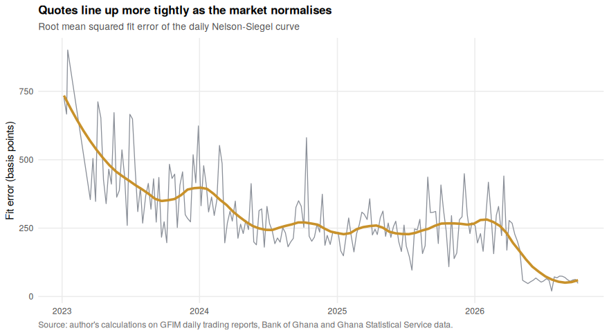

<p class="caption">

<span id="fig:fig-fit-quality"></span>Figure 4.2: Curve fit error over
time. The line is the root mean squared error of each day’s fit,
expressed in basis points of yield. Because the same model is used
throughout, the fall measures how much more consistently securities are
priced relative to one another, not an improvement in the model.

</p>

</div>

``` r
fits |> mutate(Year = as.character(year(report_date))) |>
  group_by(Year) |>
  summarise(Curves = n(), `Median fit error (bp)` = round(median(rmse_bp)),
            `Median securities` = median(n), `Median traded` = median(n_traded),
            .groups = "drop") |>
  tbl("Fit quality by year. Fit error falls by roughly a factor of six between 2023 and 2026 while the number of securities quoted rises.")
```

| Year | Curves | Median fit error (bp) | Median securities | Median traded |
|:-----|-------:|----------------------:|------------------:|--------------:|
| 2023 |     45 |                   416 |                71 |          38.0 |
| 2024 |     52 |                   258 |                91 |          54.5 |
| 2025 |     52 |                   247 |                92 |          50.5 |
| 2026 |     40 |                    73 |               101 |          55.5 |

<span id="tab:tab-fit-quality"></span>Table 4.3: Fit quality by year.
Fit error falls by roughly a factor of six between 2023 and 2026 while
the number of securities quoted rises.

This is a result, not a technical footnote. A large fit error means
securities of similar maturity are quoted at very different yields,
which happens when few people are trading and marks are guesses. **The
sixfold fall in fit error is a measure of market repair.** It also means
the 2023 curves should be read as indicative, and any conclusion drawn
from them stated with that caveat.

## 4.4 Finding 3: level, slope and curvature

``` r
fits |> select(report_date, Level = level, Slope = slope, Curvature = curvature) |>
  pivot_longer(-report_date, names_to = "Factor") |>
  ggplot(aes(report_date, value, colour = Factor)) +
  geom_hline(yintercept = 0, colour = "grey75", linewidth = .4) +
  geom_line(linewidth = .7) +
  scale_colour_manual(values = c(Level = navy, Slope = gold, Curvature = red)) +
  labs(title = "Nelson-Siegel factors",
       subtitle = "Fitted parameters of the daily curve",
       x = NULL, y = "Percentage points", caption = SRC)
```

<div class="figure" style="text-align: center">

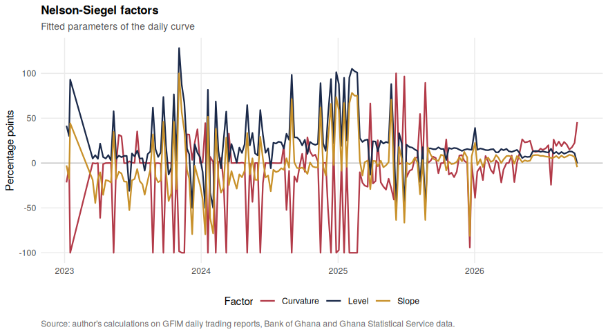

<p class="caption">

<span id="fig:fig-factors"></span>Figure 4.3: The three Nelson-Siegel
factors through time. Level is the long-run rate the curve tends to;
slope is the gap between short and long rates (positive means short
rates are below long rates); curvature captures the hump in the middle
of the curve.

</p>

</div>

``` r
z_weekly <- fits |> select(report_date, starts_with("z")) |> arrange(report_date)
dz <- z_weekly |> select(-report_date) |> as.matrix() |> diff()
pca <- prcomp(dz, center = TRUE, scale. = FALSE)
explained <- pca$sdev^2 / sum(pca$sdev^2)

as_tibble(pca$rotation[, 1:3], rownames = "mat") |>
  mutate(maturity = as.numeric(str_remove_all(mat, "[zy]"))) |>
  pivot_longer(PC1:PC3, names_to = "Component") |>
  ggplot(aes(maturity, value, colour = Component)) +
  geom_hline(yintercept = 0, colour = "grey75") +
  geom_line(linewidth = .9) + geom_point(size = 1.5) +
  scale_colour_manual(values = c(PC1 = navy, PC2 = gold, PC3 = red),
                      labels = c(paste0("PC1 level (", percent(explained[1], .1), ")"),
                                 paste0("PC2 slope (", percent(explained[2], .1), ")"),
                                 paste0("PC3 curvature (", percent(explained[3], .1), ")"))) +
  labs(title = "Three factors explain almost all curve movement",
       subtitle = "Loadings from PCA of weekly zero-rate changes",
       x = "Years to maturity", y = "Loading", caption = SRC)
```

<div class="figure" style="text-align: center">

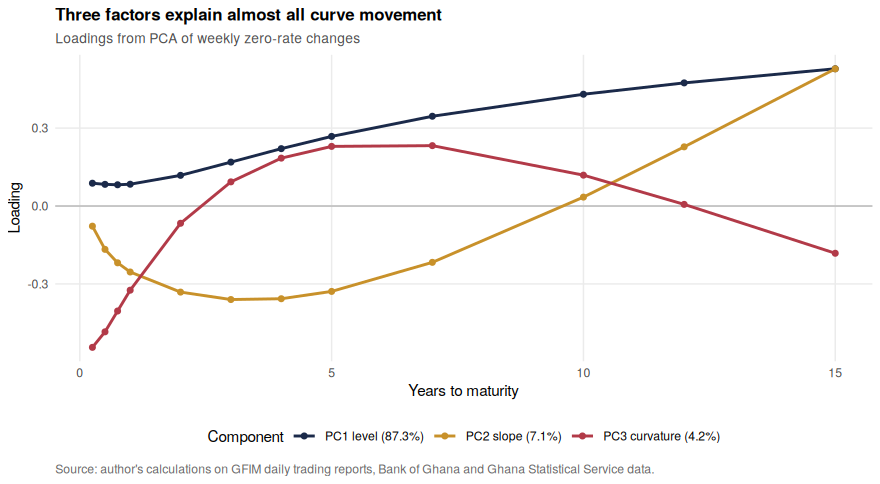

<p class="caption">

<span id="fig:fig-pca"></span>Figure 4.4: Principal component analysis
of weekly changes in the fitted curve. PC1 moves all maturities in the
same direction (a level shift), PC2 moves short and long rates in
opposite directions (a slope change) and PC3 moves the middle against
the ends (curvature).

</p>

</div>

``` r
tibble(Component = paste0("PC", 1:4),
       `Share of variance` = percent(explained[1:4], accuracy = 0.1),
       Interpretation = c("Level: all rates move together",
                          "Slope: short and long rates diverge",
                          "Curvature: the middle moves against the ends",
                          "Residual")) |>
  tbl("Share of weekly curve variation explained by each principal component.")
```

| Component | Share of variance | Interpretation                               |
|:----------|-------------------|:---------------------------------------------|
| PC1       | 87.3%             | Level: all rates move together               |
| PC2       | 7.1%              | Slope: short and long rates diverge          |
| PC3       | 4.2%              | Curvature: the middle moves against the ends |
| PC4       | 1.2%              | Residual                                     |

<span id="tab:tab-pca"></span>Table 4.4: Share of weekly curve variation
explained by each principal component.

Three factors explain 98.6% of weekly curve movement, and the level
factor alone explains 87.3%. That level share is higher than the 60–70%
typically reported for developed markets. The practical reading: in
Ghana, rates mostly move *together*, driven by one macro force, so a
bond portfolio’s dominant risk is a general rise in rates rather than a
change in the curve’s shape. Section <a href="#risk">5.2</a> puts a cedi
figure on that.

## 4.5 Finding 4: the curve, the policy rate and inflation

``` r
monthly <- fits |>
  mutate(date = ceiling_date(report_date, "month") - 1) |>
  group_by(date) |>
  summarise(`3-month zero` = mean(z0.25y), `1-year zero` = mean(z1y),
            `10-year zero` = mean(z10y), .groups = "drop") |>
  left_join(select(panel, date, `Policy rate` = policy_rate_pct,
                   `Headline inflation` = headline_inflation_pct), by = "date")

monthly |> pivot_longer(-date, names_to = "Series") |> filter(!is.na(value)) |>
  ggplot(aes(date, value, colour = Series, linetype = Series)) +
  geom_line(linewidth = .8) +
  scale_colour_manual(values = c(`3-month zero` = gold, `1-year zero` = navy,
                                 `10-year zero` = grey, `Policy rate` = red,
                                 `Headline inflation` = "black")) +
  scale_linetype_manual(values = c(`3-month zero` = 1, `1-year zero` = 1,
                                   `10-year zero` = 1, `Policy rate` = 2,
                                   `Headline inflation` = 3)) +
  guides(colour = guide_legend(nrow = 2)) +
  labs(title = "Market rates, policy rate and inflation",
       subtitle = "Monthly averages of the fitted curve against macro series",
       x = NULL, y = "Percent", caption = SRC)
```

<div class="figure" style="text-align: center">

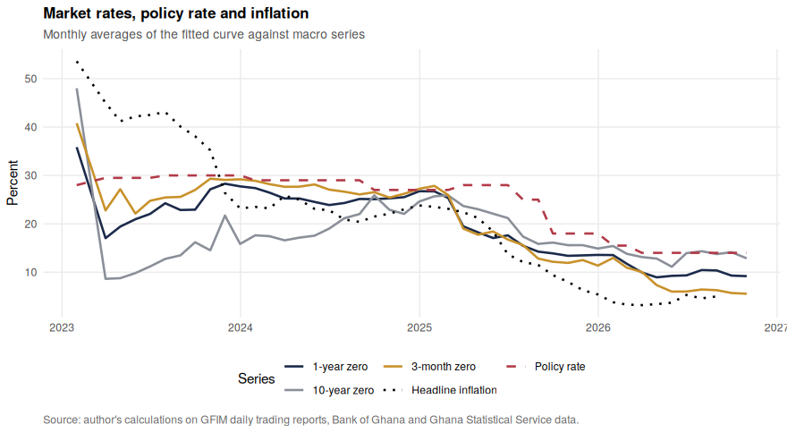

<p class="caption">

<span id="fig:fig-macro"></span>Figure 4.5: Fitted zero rates against
the Bank of Ghana policy rate and headline inflation. Market rates fell
ahead of the policy rate through 2025; the three-month rate only settles
below the policy rate late in the sample.

</p>

</div>

``` r
real_tbl <- monthly |>
  mutate(real = `1-year zero` - `Headline inflation`) |>
  filter(!is.na(real))

bind_rows(head(real_tbl, 3), tail(real_tbl, 3)) |>
  transmute(Month = format(date, "%b %Y"),
            `1-year rate (%)` = round(`1-year zero`, 2),
            `Inflation (%)` = `Headline inflation`,
            `Real rate (pp)` = round(real, 2)) |>
  tbl("The one-year rate against inflation: first and last three months with inflation data. A negative real rate means a saver loses purchasing power even after interest.")
```

| Month    | 1-year rate (%) | Inflation (%) | Real rate (pp) |
|:---------|----------------:|--------------:|---------------:|
| Jan 2023 |           35.85 |          53.6 |         -17.75 |
| Mar 2023 |           17.04 |          45.0 |         -27.96 |
| Apr 2023 |           19.43 |          41.2 |         -21.77 |
| Jun 2026 |            9.34 |           5.3 |           4.04 |
| Jul 2026 |           10.44 |           4.6 |           5.84 |
| Aug 2026 |           10.35 |           5.0 |           5.35 |

<span id="tab:tab-real-rates"></span>Table 4.5: The one-year rate
against inflation: first and last three months with inflation data. A
negative real rate means a saver loses purchasing power even after
interest.

Table <a href="#tab:tab-real-rates">4.5</a> carries the clearest message
for a non-specialist. In early 2023 a saver lending to the government
for a year earned far less than prices rose, so money in Treasury bills
**lost** real value. By 2026 the same saver earns several points above
inflation.

## 4.6 Finding 5: what the curve expects next

``` r
fwd <- function(z1, t1, z2, t2) (z2 * t2 - z1 * t1) / (t2 - t1)

fits |>
  transmute(report_date,
            `1-year spot` = z1y,
            `1y in 1y forward` = fwd(z1y, 1, z2y, 2),
            `5y in 5y forward` = fwd(z5y, 5, z10y, 10)) |>
  pivot_longer(-report_date, names_to = "Series") |>
  ggplot(aes(report_date, value, colour = Series)) +
  geom_line(linewidth = .8) +
  scale_colour_manual(values = c(`1-year spot` = navy,
                                 `1y in 1y forward` = gold,
                                 `5y in 5y forward` = grey)) +
  labs(title = "Spot and implied forward rates",
       subtitle = "What today's curve implies about future borrowing costs",
       x = NULL, y = "Percent", caption = SRC)
```

<div class="figure" style="text-align: center">

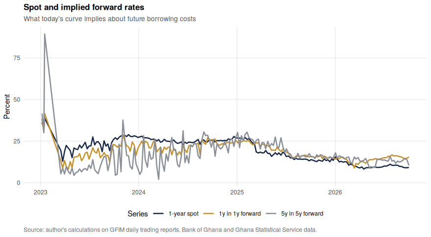

<p class="caption">

<span id="fig:fig-forwards"></span>Figure 4.6: Spot and forward rates.
The 1-year-in-1-year forward is the rate the market implies for
borrowing one year, starting a year from now; the 5y5y forward is the
ten-year horizon equivalent. When forwards sit above spot rates, the
market expects rates to rise.

</p>

</div>

# 5 Applications

## 5.1 Which securities look rich or cheap?

``` r
zfn <- function(t) ns_zero(t, p_ns[1], p_ns[2], p_ns[3], p_ns[4])
mp <- model_prices(day, zfn)

model_yield <- vapply(seq_len(nrow(day$rows)), function(i) {
  r <- day$rows[i, ]
  if (r$instrument == "BILL") bill_yield(mp[i], max(round(r$ttm_years * 365), 1))
  else bond_ytm(mp[i] - accrued_interest(last_date, r$maturity_date, r$coupon_pct),
                last_date, r$maturity_date, r$coupon_pct)
}, numeric(1))

rc <- day$rows |>
  mutate(model_price = mp, market_price = day$price, model_yield = model_yield,
         spread_bp = round((yield_pct - model_yield) * 100, 1),
         signal = case_when(spread_bp > 50 ~ "Cheap", spread_bp < -50 ~ "Rich",
                            TRUE ~ "Fair")) |>
  select(isin, instrument, security, maturity_date, ttm_years, coupon_pct,
         yield_pct, model_yield, spread_bp, traded, volume, signal)

rc |> filter(traded, instrument == "BOND") |> arrange(spread_bp) |>
  transmute(ISIN = isin, Maturity = format(maturity_date, "%b %Y"),
            `Years` = round(ttm_years, 2), `Coupon (%)` = coupon_pct,
            `Market yield (%)` = round(yield_pct, 2),
            `Curve yield (%)` = round(model_yield, 2),
            `Difference (bp)` = spread_bp, Signal = signal) |>
  head(10) |>
  tbl(paste("Traded bonds ranked richest to cheapest against the fitted curve,",
            format(last_date, "%d %B %Y"), ". A positive difference means the bond yields more than the curve implies, so it is cheap."))
```

| ISIN         | Maturity | Years | Coupon (%) | Market yield (%) | Curve yield (%) | Difference (bp) | Signal |
|:-------------|:---------|------:|-----------:|------------------|-----------------|----------------:|:-------|
| GHGGOG069964 | Feb 2032 |  5.36 |       9.10 | 14.20            | 15.49           |          -129.3 | Rich   |
| GHGGOG069998 | Feb 2035 |  8.35 |       9.55 | 14.36            | 14.57           |           -21.4 | Fair   |
| GHGGOG069980 | Feb 2034 |  7.35 |       9.40 | 15.01            | 14.99           |             2.4 | Fair   |
| GHGGOG069881 | Aug 2028 |  1.87 |      10.00 | 12.50            | 12.21           |            29.1 | Fair   |
| GHGGOG069931 | Feb 2029 |  2.37 |       8.65 | 13.81            | 13.36           |            44.9 | Fair   |

<span id="tab:rich-cheap"></span>Table 5.1: Traded bonds ranked richest
to cheapest against the fitted curve, 02 October 2026 . A positive
difference means the bond yields more than the curve implies, so it is
cheap.

``` r
ggplot(rc, aes(ttm_years, spread_bp,
               colour = ifelse(traded, "Traded", "Not traded"))) +
  geom_hline(yintercept = 0, colour = red, linewidth = .7) +
  geom_hline(yintercept = c(-50, 50), colour = "grey80", linetype = 2) +
  geom_point(size = 2, alpha = .85) +
  scale_colour_manual(values = c(Traded = navy, `Not traded` = grey)) +
  labs(title = "Rich/cheap screen against the fitted curve",
       subtitle = paste("Market yield minus curve yield,", format(last_date, "%d %B %Y")),
       x = "Years to maturity", y = "Difference (basis points)",
       colour = NULL, caption = SRC)
```

<div class="figure" style="text-align: center">

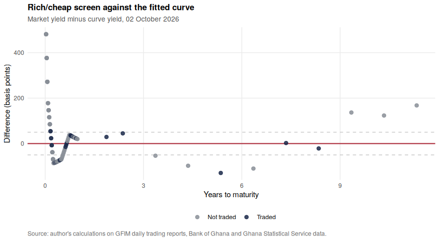

<p class="caption">

<span id="fig:fig-rich-cheap"></span>Figure 5.1: Each security’s market
yield minus the yield implied by the fitted curve. Points above zero are
cheap relative to the curve, points below are rich. Dashed lines mark
plus and minus 50 basis points. Grey points did not trade, so a wide gap
there usually means a stale mark rather than an opportunity.

</p>

</div>

## 5.2 What a rate move costs a portfolio

``` r
duration_dv01 <- function(ytm, settle, maturity, coupon, freq = 2) {
  d <- coupon_dates(settle, maturity, freq)
  t <- yearfrac(settle, d); n <- t * freq
  cf <- rep(coupon / freq, length(d)); cf[length(cf)] <- cf[length(cf)] + 100
  y <- ytm / 100 / freq; pv <- cf / (1 + y)^n; dirty <- sum(pv)
  mac <- sum(t * pv) / dirty; mod <- mac / (1 + y)
  c(dirty = dirty, macaulay = mac, modified = mod, dv01 = mod * dirty / 10000)
}

port <- rc |> filter(instrument == "BOND", traded) |> mutate(face = 1e6 / n())
risk <- t(vapply(seq_len(nrow(port)), function(i)
  duration_dv01(port$yield_pct[i], last_date, port$maturity_date[i],
                port$coupon_pct[i]), numeric(4)))
port <- port |> mutate(modified_duration = risk[, "modified"],
                       dv01_per_100 = risk[, "dv01"],
                       dv01_ghs = dv01_per_100 * face / 100)

port |> transmute(ISIN = isin, `Years` = round(ttm_years, 2),
                  `Coupon (%)` = coupon_pct, `Yield (%)` = round(yield_pct, 2),
                  `Modified duration` = round(modified_duration, 2),
                  `Face (GHS)` = round(face),
                  `DV01 (GHS)` = round(dv01_ghs, 2)) |>
  tbl("An equally weighted GHS 1 million portfolio of the bonds that traded on the last day. DV01 is the loss from a one basis point rise in yields.")
```

| ISIN         | Years | Coupon (%) | Yield (%) | Modified duration | Face (GHS) | DV01 (GHS) |
|:-------------|------:|-----------:|----------:|------------------:|-----------:|-----------:|
| GHGGOG069881 |  1.87 |      10.00 |     12.50 |              1.63 |      2e+05 |      31.64 |
| GHGGOG069931 |  2.37 |       8.65 |     13.81 |              2.02 |      2e+05 |      36.71 |
| GHGGOG069964 |  5.36 |       9.10 |     14.20 |              3.89 |      2e+05 |      64.27 |
| GHGGOG069980 |  7.35 |       9.40 |     15.01 |              4.71 |      2e+05 |      72.33 |
| GHGGOG069998 |  8.35 |       9.55 |     14.36 |              5.10 |      2e+05 |      79.96 |

<span id="tab:risk"></span>Table 5.2: An equally weighted GHS 1 million
portfolio of the bonds that traded on the last day. DV01 is the loss
from a one basis point rise in yields.

``` r
shocks <- list(
  "Parallel +100bp"              = function(t) rep(100, length(t)),
  "Parallel -100bp"              = function(t) rep(-100, length(t)),
  "Steepener (1y -50, 10y +50)"  = function(t) approx(c(1, 10), c(-50, 50), t, rule = 2)$y,
  "Flattener (1y +50, 10y -50)"  = function(t) approx(c(1, 10), c(50, -50), t, rule = 2)$y,
  "Front-end selloff (+200bp under 2y)" = function(t) ifelse(t <= 2, 200, 0))

imap_dfr(shocks, ~ tibble(Scenario = .y,
                          `P&L (GHS)` = -sum(port$dv01_ghs * .x(port$ttm_years)))) |>
  mutate(`Share of face value` = percent(`P&L (GHS)` / 1e6, accuracy = 0.01)) |>
  tbl(paste0("Profit and loss on the GHS 1 million portfolio under five rate scenarios. Portfolio DV01 is GHS ",
             round(sum(port$dv01_ghs), 2), " per basis point."))
```

| Scenario                            |  P&L (GHS) | Share of face value |
|:------------------------------------|-----------:|:--------------------|
| Parallel +100bp                     | -28,489.87 | -2.85%              |
| Parallel -100bp                     |  28,489.87 | 2.85%               |
| Steepener (1y -50, 10y +50)         |  -1,362.49 | -0.14%              |
| Flattener (1y +50, 10y -50)         |   1,362.49 | 0.14%               |
| Front-end selloff (+200bp under 2y) |  -6,328.34 | -0.63%              |

<span id="tab:tab-scenarios"></span>Table 5.3: Profit and loss on the
GHS 1 million portfolio under five rate scenarios. Portfolio DV01 is GHS
284.9 per basis point.

Table <a href="#tab:tab-scenarios">5.3</a> translates the PCA result
into money. A general rise in rates of one percentage point costs about
twenty times what a same-sized change in the curve’s *shape* costs. For
a treasury or pension desk, that is the argument for hedging the level
exposure first and worrying about slope second.

# 6 What this means, in plain terms

``` r
tibble(
  `Who` = c("Government / Ministry of Finance", "Banks and pension funds",
            "Businesses borrowing", "Households and savers", "The market itself"),
  `What the results imply` = c(
    "Borrowing costs have fallen sharply across every maturity, and the curve now slopes up normally. Longer issuance has become viable again, though it is still priced at a premium to short borrowing.",
    "Interest rate risk is dominated by the general level of rates, not the curve's shape. A portfolio of government bonds gains or loses mostly when all rates move together, so level hedging matters most.",
    "Loan pricing benchmarks anchored to Treasury rates have fallen by double digits since 2023, which lowers the hurdle rate for investment.",
    "Treasury bills lost purchasing power through 2023 because inflation exceeded the interest earned. Since 2025 they have paid a clear positive real return.",
    "Securities of similar maturity are now priced far more consistently than in 2023. That is a sign of returning liquidity and confidence rather than a modelling artefact.")
) |>
  tbl("Implications of the results for different users of the yield curve.") |>
  wide()
```

| Who                              | What the results imply                                                                                                                                                                                   |
|:---------------------------------|:---------------------------------------------------------------------------------------------------------------------------------------------------------------------------------------------------------|
| Government / Ministry of Finance | Borrowing costs have fallen sharply across every maturity, and the curve now slopes up normally. Longer issuance has become viable again, though it is still priced at a premium to short borrowing.     |
| Banks and pension funds          | Interest rate risk is dominated by the general level of rates, not the curve’s shape. A portfolio of government bonds gains or loses mostly when all rates move together, so level hedging matters most. |
| Businesses borrowing             | Loan pricing benchmarks anchored to Treasury rates have fallen by double digits since 2023, which lowers the hurdle rate for investment.                                                                 |
| Households and savers            | Treasury bills lost purchasing power through 2023 because inflation exceeded the interest earned. Since 2025 they have paid a clear positive real return.                                                |
| The market itself                | Securities of similar maturity are now priced far more consistently than in 2023. That is a sign of returning liquidity and confidence rather than a modelling artefact.                                 |

<span id="tab:tab-implications"></span>Table 6.1: Implications of the
results for different users of the yield curve.

# 7 Limitations

``` r
tibble(
  Limitation = c("Thin bond trading", "Long end is extrapolated",
                 "Pre-DDEP bonds excluded", "2023 curves are indicative",
                 "Inflation is monthly and lagged", "No credit or liquidity decomposition"),
  `What it means for the results` = c(
    "Roughly six in ten quote rows are carried-over marks. Weighting reduces their influence but cannot remove it.",
    paste0("The longest traded bond matures in about ", round(max(fits$max_ttm, na.rm = TRUE), 1),
           " years, so fitted rates beyond that are model extrapolation, not observation."),
    "The fitted curve describes the post-DDEP market. A robustness check including the old bonds would shift the long end up.",
    paste0("Median fit error in 2023 was about ",
           round(median(fits$rmse_bp[year(fits$report_date) == 2023])),
           " basis points, so levels from that year should be quoted with a margin."),
    "Real rates are computed ex post against published inflation, not against expected inflation, which is what a lender actually prices.",
    "The curve mixes expectations, term premium, credit and liquidity. Separating them would need instruments Ghana does not yet have, such as an index-linked bond.")
) |>
  tbl("Limitations of the analysis.") |>
  wide()
```

| Limitation                           | What it means for the results                                                                                                                                   |
|:-------------------------------------|:----------------------------------------------------------------------------------------------------------------------------------------------------------------|
| Thin bond trading                    | Roughly six in ten quote rows are carried-over marks. Weighting reduces their influence but cannot remove it.                                                   |
| Long end is extrapolated             | The longest traded bond matures in about 16.5 years, so fitted rates beyond that are model extrapolation, not observation.                                      |
| Pre-DDEP bonds excluded              | The fitted curve describes the post-DDEP market. A robustness check including the old bonds would shift the long end up.                                        |
| 2023 curves are indicative           | Median fit error in 2023 was about 416 basis points, so levels from that year should be quoted with a margin.                                                   |
| Inflation is monthly and lagged      | Real rates are computed ex post against published inflation, not against expected inflation, which is what a lender actually prices.                            |
| No credit or liquidity decomposition | The curve mixes expectations, term premium, credit and liquidity. Separating them would need instruments Ghana does not yet have, such as an index-linked bond. |

<span id="tab:tab-limitations"></span>Table 7.1: Limitations of the
analysis.

# 8 Conclusion

``` r
tibble(
  Objective = c("1. Assemble the data", "2. Establish conventions",
                "3. Fit daily curves", "4. Describe the evolution",
                "5. Apply the curve"),
  Result = c(
    paste0(format(nrow(quotes), big.mark = ","), " security-day quotes over ",
           n_distinct(quotes$report_date), " trading days, joined to auctions, the policy rate and inflation."),
    "Bills: money-market yield, actual/364, reproduces published yields exactly. Bonds: semi-annual, actual/365, quoted clean, median pricing error 0.03 per 100 on traded quotes.",
    paste0(nrow(fits), " curves fitted; Nelson-Siegel chosen over Svensson and bootstrapping for smoothness with comparable accuracy. Fit error fell from ",
           round(median(fits$rmse_bp[year(fits$report_date) == 2023])), "bp in 2023 to ",
           round(median(fits$rmse_bp[year(fits$report_date) == 2026])), "bp in 2026."),
    paste0("Inverted and distressed in 2023, flat in 2024, upward sloping by 2026. Level explains ",
           percent(explained[1], accuracy = 0.1), " of weekly changes; three factors explain ",
           percent(sum(explained[1:3]), accuracy = 0.1), ". The one-year real rate moved from deeply negative to clearly positive."),
    paste0("Rich/cheap screen on ", nrow(rc), " securities and a scenario analysis showing a GHS 1m bond portfolio with DV01 of GHS ",
           round(sum(port$dv01_ghs), 2), " per basis point, dominated by level risk."))
) |>
  tbl("Objectives and what the analysis delivered against each.") |>
  wide()
```

| Objective                  | Result                                                                                                                                                                                                             |
|:---------------------------|:-------------------------------------------------------------------------------------------------------------------------------------------------------------------------------------------------------------------|
| 1\. Assemble the data      | 130,719 security-day quotes over 875 trading days, joined to auctions, the policy rate and inflation.                                                                                                              |
| 2\. Establish conventions  | Bills: money-market yield, actual/364, reproduces published yields exactly. Bonds: semi-annual, actual/365, quoted clean, median pricing error 0.03 per 100 on traded quotes.                                      |
| 3\. Fit daily curves       | 189 curves fitted; Nelson-Siegel chosen over Svensson and bootstrapping for smoothness with comparable accuracy. Fit error fell from 416bp in 2023 to 73bp in 2026.                                                |
| 4\. Describe the evolution | Inverted and distressed in 2023, flat in 2024, upward sloping by 2026. Level explains 87.3% of weekly changes; three factors explain 98.6%. The one-year real rate moved from deeply negative to clearly positive. |
| 5\. Apply the curve        | Rich/cheap screen on 99 securities and a scenario analysis showing a GHS 1m bond portfolio with DV01 of GHS 284.9 per basis point, dominated by level risk.                                                        |

<span id="tab:tab-summary"></span>Table 8.1: Objectives and what the
analysis delivered against each.

Three and a half years after the default, the price of Ghanaian
government debt looks like the price of debt in a working market again.
The curve slopes upward, savers earn a positive real return, and
securities of similar maturity are quoted at similar yields rather than
scattered. The curve is not yet complete: trading beyond ten years is
thin, and the long end is as much model as market. But the direction,
and the speed, are unambiguous in the data.

The natural extensions are a term premium decomposition once a longer
history exists, a liquidity-adjusted curve that uses trade volume
directly, and a rolling out-of-sample test of whether the rich/cheap
signal predicts subsequent returns.

# 9 Appendix: reproducibility

The report reads one workbook,
`Ghana_Yield_Curve_Dataset_2023_2026.xlsx`, produced by the data
pipeline described in Section <a href="#data">2</a>. Set
`fit_frequency: "daily"` in the YAML header to fit all 875 trading days
instead of weekly.

``` r
write.csv(fits, "ghana_zero_curves.csv", row.names = FALSE)
write.csv(rc, paste0("rich_cheap_", last_date, ".csv"), row.names = FALSE)
```

``` r
sessionInfo()
```

    ## R version 4.3.3 (2024-02-29)
    ## Platform: x86_64-pc-linux-gnu (64-bit)
    ## Running under: Ubuntu 24.04.4 LTS
    ## 
    ## Matrix products: default
    ## BLAS:   /usr/lib/x86_64-linux-gnu/blas/libblas.so.3.12.0 
    ## LAPACK: /usr/lib/x86_64-linux-gnu/lapack/liblapack.so.3.12.0
    ## 
    ## locale:
    ## [1] C
    ## 
    ## time zone: Etc/UTC
    ## tzcode source: system (glibc)
    ## 
    ## attached base packages:
    ## [1] stats     graphics  grDevices utils     datasets  methods   base     
    ## 
    ## other attached packages:
    ##  [1] patchwork_1.2.0 knitr_1.45      scales_1.3.0    stringr_1.5.1  
    ##  [5] purrr_1.0.2     lubridate_1.9.3 ggplot2_3.4.4   tidyr_1.3.1    
    ##  [9] dplyr_1.1.4     readxl_1.4.3   
    ## 
    ## loaded via a namespace (and not attached):
    ##  [1] Matrix_1.6-5     gtable_0.3.4     highr_0.10       compiler_4.3.3  
    ##  [5] tidyselect_1.2.0 splines_4.3.3    yaml_2.3.8       fastmap_1.1.1   
    ##  [9] lattice_0.22-5   R6_2.5.1         labeling_0.4.3   generics_0.1.3  
    ## [13] tibble_3.2.1     bookdown_0.37    munsell_0.5.0    pillar_1.9.0    
    ## [17] rlang_1.1.3      utf8_1.2.4       stringi_1.8.3    xfun_0.41       
    ## [21] timechange_0.3.0 cli_3.6.2        mgcv_1.9-1       withr_2.5.0     
    ## [25] magrittr_2.0.3   digest_0.6.34    grid_4.3.3       nlme_3.1-164    
    ## [29] lifecycle_1.0.4  vctrs_0.6.5      evaluate_0.23    glue_1.7.0      
    ## [33] farver_2.1.1     cellranger_1.1.0 codetools_0.2-19 fansi_1.0.5     
    ## [37] colorspace_2.1-0 rmarkdown_2.25   tools_4.3.3      pkgconfig_2.0.3 
    ## [41] htmltools_0.5.7
